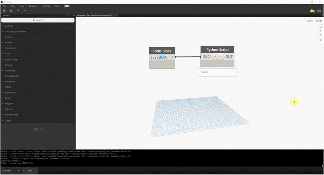

________________

# ProgressBar

The form is written and compiled as a library in C#. You can load the .dll file the same way you are loading any external library in Python.

This is pretty much the exact Progress Bar created by Jeremy Tammik as described [here](http://thebuildingcoder.typepad.com/blog/2013/01/implement-a-progress-bar-and-abort-a-lengthy-process.html).

You can find the [ProgressBar.dll](ProgressBar.dll) and a sample [Dynamo definition] (ProgressBar.dyn) in the root of the Git above.
